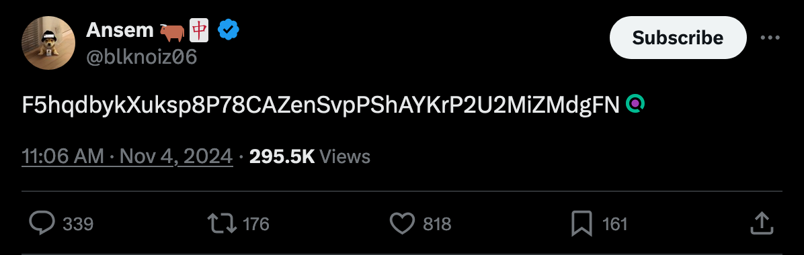
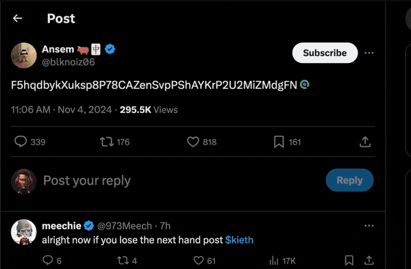

  
  
  # Solana-X-Peek

  

    <a href="#-features">Features</a> •
    <a href="#-installation">Installation</a> •
    <a href="#-how-it-works">How It Works</a> •
    <a href="#-privacy--security">Privacy</a>
  

---

  
A lightweight Firefox extension that automatically detects Solana wallet addresses on Twitter/X and converts them into clickable links to Solscan explorer.

## ✨ Features

- 🔍 Real-time scanning of tweets for Solana addresses
- 🔗 Automatic conversion to clickable Solscan links
- 💫 Clean UI with hover animations
- ⚡ Efficient performance with throttled scanning
- 🌐 Works on both Twitter.com and X.com domains

## 🚀 How It Works

The extension scans tweet content for Solana wallet addresses using a precise regex pattern. When an address is found, it:

1. Creates an unobtrusive link next to the address
2. Adds the Solscan logo as a visual indicator
3. Opens the wallet details in Solscan site when clicked

## 🛠 Technical Implementation

- Uses MutationObserver for dynamic content updates
- Implements throttling to optimize performance
- Maintains processed elements in WeakSet to prevent duplicates
- Handles DOM manipulation carefully to preserve tweet formatting

## 📥 Installation

### Firefox Add-ons Store (coming soon)

1. Visit the Firefox Add-ons Store [link to be added]
2. Click "Add to Firefox"
3. Follow the prompts to complete installation

### Manual Installation (Developer)

1. Clone this repository
2. Open Firefox and navigate to `about:debugging`
3. Click "This Firefox" in the left sidebar
4. Click "Load Temporary Add-on"
5. Navigate to the extension directory and select `manifest.json`

## 📸 Demo

  
  
<em>Automatic detection of Solana address in a tweet</em>

  
  
<em> Solana-X-Peek extension showing clickable Solscan link in action</em>

## 🔒 Privacy & Security

- No data collection or storage
- Works entirely client-side
- Only activates on Twitter/X domains
- Requires minimal permissions

## 🔮 Future Improvements

- Support for additional Solana explorers
- Add clipboard copy functionality to address

## 📄 License

MIT License - feel free to use and modify as needed.

---

  
Made with ❤️ for the Solana Community

