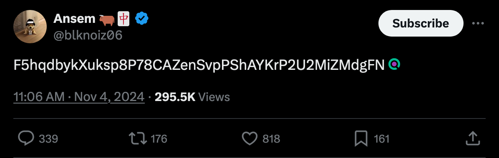
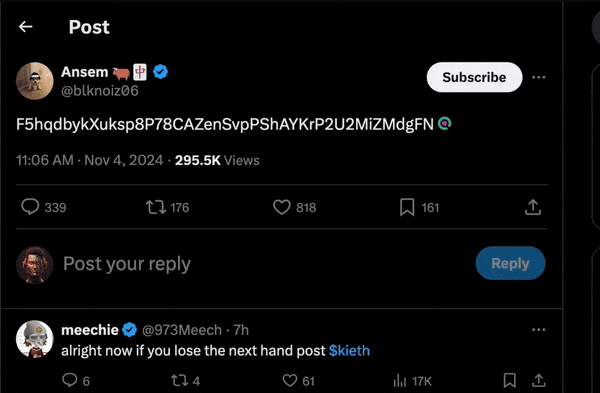

<div align="center">
  

  # Solana-X-Peek
</div>

<div align="center">


</div>

A Firefox extension that detects Solana wallet addresses in tweets on X (Twitter) and adds a clickable Solscan link next to each one.

<div align="center">
  
  <br/>
  
</div>

## Features

- Scans tweet text for Solana addresses as you browse
- Adds a Solscan link (`solscan.io/account/<address>`) beside each match
- Works on both `twitter.com` and `x.com`
- Reacts to new tweets loaded on scroll via `MutationObserver`, throttled to one scan per second
- Runs entirely in the browser, no accounts or network calls of its own

## Requirements

- Firefox (any recent version that supports Manifest V2 extensions)

## Install

Not yet on the Firefox Add-ons store. Load it manually:

1. Clone this repository:
   ```bash
   git clone https://github.com/TechTronixx/Solana-X-Peek.git
   ```
2. Open Firefox and go to `about:debugging`.
3. Click **This Firefox** in the sidebar.
4. Click **Load Temporary Add-on**.
5. Select the `manifest.json` file in the cloned folder.

The extension stays loaded until you restart Firefox.

## Usage

Open X or Twitter and browse normally. When a tweet contains a Solana address, a small Solscan logo appears just after it. Click the logo to open that account on Solscan in a new tab.

## How it works

Scans tweet text for base58 strings that match the Solana address length. When found, a Solscan link is inserted next to the address. New tweets loaded on scroll are picked up automatically.

Note: the pattern is a heuristic, so an unrelated string of the right length can occasionally get a link.

## Privacy

- No data collection or storage
- No network requests except the Solscan link you click
- Runs only on `twitter.com` and `x.com`
- Requests only the `activeTab` and `storage` permissions

## Roadmap

- Support for additional Solana explorers
- Copy-address-to-clipboard action

## License

[MIT](LICENSE) © TechTronixx

---

<div align="center">
  <p>Made with ❤️ for the Solana Community</p>
</div>
